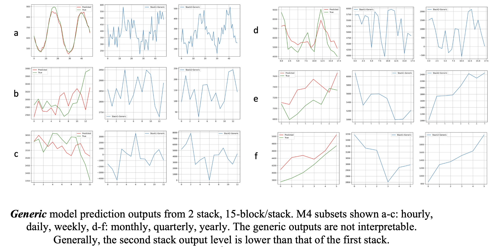
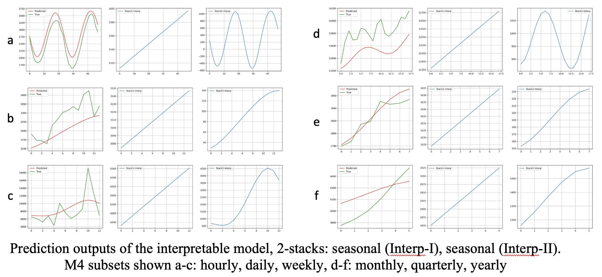
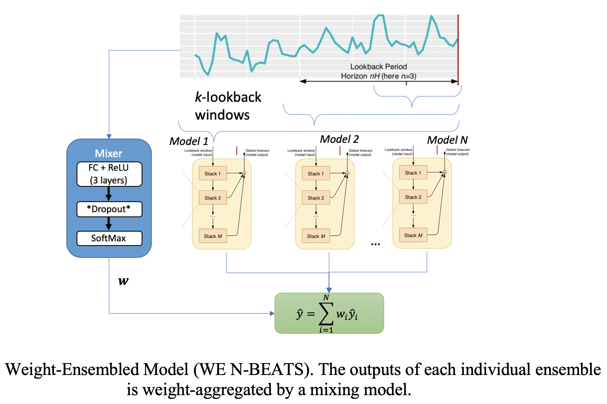
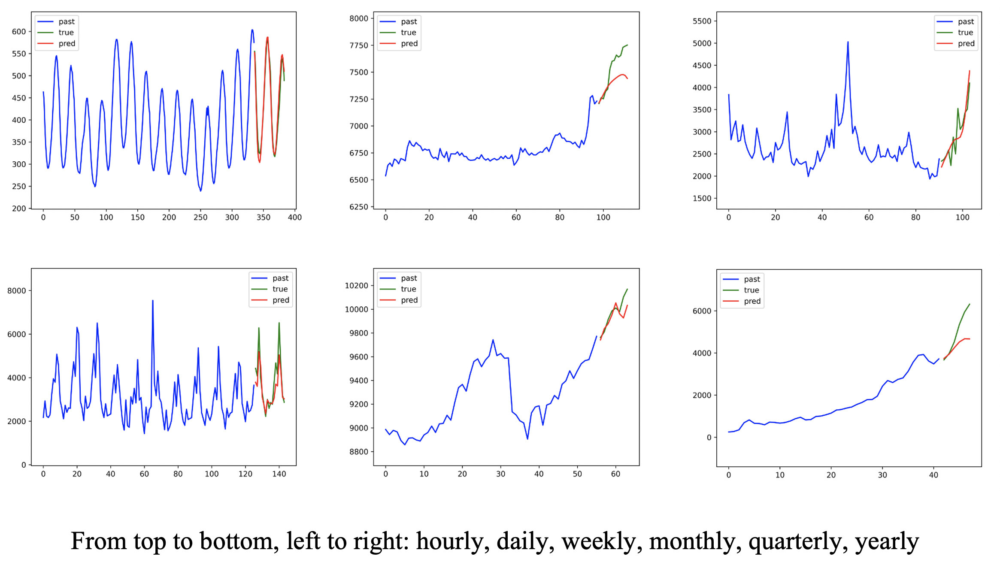

# Experiments with N-BEATS (Neural basis expansion analysis for interpretable time series forecasting)
Project with a TensorFlow implementation of [N-BEATS](https://arxiv.org/pdf/1905.10437.pdf) and experiments with ensembles.

##### Implementation 
TensorFlow implementation of N-BEATS adapted from PyTorch variant found [here](https://github.com/philipperemy/n-beats)

##### Generic

##### Interpretable

##### Weighted-Ensembling
If we view each ensemble member as an expert forecaster, then a gating network [1] can be used to select an expert or blend their outputs. 
In the blended approach the error of the output affects the weight updates of all the experts, and as such there is *co-adaptation* between them.
I explore one way to reduce co-adaptations by using a [dropout](https://arxiv.org/pdf/1207.0580.pdf) layer, implemented as Weighted-Ensemble of N-BEATS (WE N-BEATS). 

During training, the (random) zeroing out of the gate’s outputs cancels the contribution of a member to the final error. 
The backpropagated gradient of loss would then update only those members which contributed to the loss as well as the gate network itself, thus learning proper blending weights and reducing co-adaptations.
 

#### Ensemble Example Predictions

[1]: R. A. Jacobs, M. I. Jordan, S. J. Nowlan, G. E. Hinton, “Adaptive Mixtures of Local Experts”, Neural Computation, 3: 79-87, 1991

[2]: L. Breiman, “Bagging predictors”, Machine Learning, 24(2):123–140, Aug 1996

